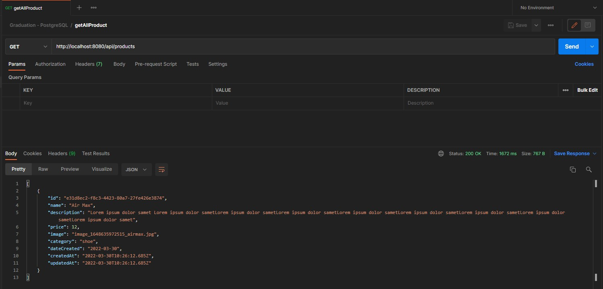
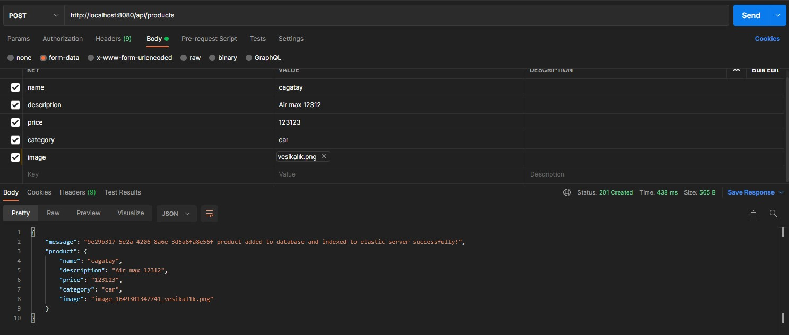

# Logo Siber Güvenlik ve Ağ Teknolojileri Full Stack Bootcamp Graduation Project Server Side

<h2>Details</h2>

<p>Server for E-commerce Project</p>

<h4>File Structure</h4>
<p>You can go directly the file by clicking the name</p>

   - [app.js](app.js)
   - __config__
     - [auth.config.js](config/auth.config.js)
     - [elastics.config.js](config/elastics.config.js)
     - [postgre.config.js](config/postgre.config.js)
   - __controllers__
     - [authController.js](controllers/authController.js)
     - [productController.js](controllers/productController.js)
     - [productControllerBackup.js](controllers/productControllerBackup.js)
     - [userController.js](controllers/userController.js)
   - [logger.js](logger.js)
   - __middlewares__
     - [index.js](middlewares/index.js)
   - __models__
     - [Product.js](models/Product.js)
     - [User.js](models/User.js)
     - [index.js](models/index.js)
   - [package.json](package.json)
   - __routes__
     - [authRouter.js](routes/authRouter.js)
     - [productRouter.js](routes/productRouter.js)
     - [userRouter.js](routes/userRouter.js)


<h4>Some Development Notes</h4>
<ul>
<li>I developed server-side with MVC approach. I used Express and NodeJS all server-side process.</li>
<li>All models are under the Models folder and all data process are under Controller folder. There are two different models as Product and User and three different controllers as auth, user and product.</li>
<li>Routing process under the Routes folder. </li>
<li>Elastic connection is inside the elastics.config.js file but all the crud process are inside the controller file.</li>
</ul>

<h4>Some ScreenShots from API</h4>



## Project setup
```
cd psqlserver
npm install
npm run dev
```
